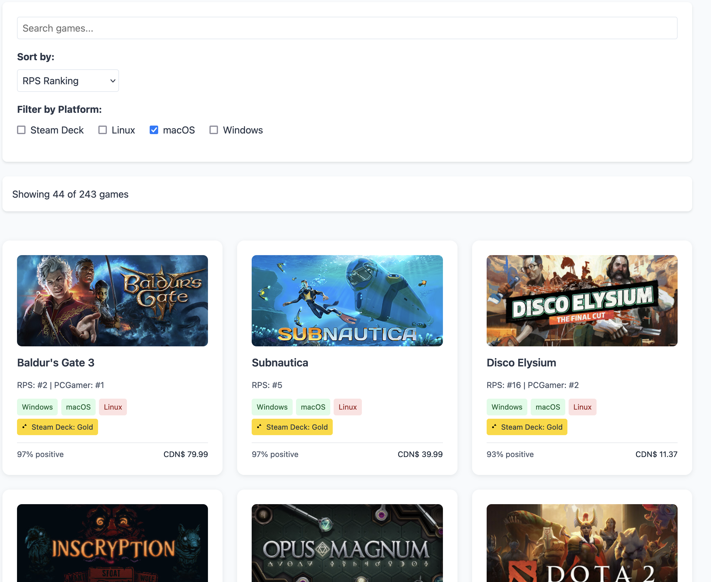

# 🎮 Game Compatibility Tracker

A web application that aggregates top-rated games from major gaming websites and shows their compatibility across different platforms. Built with modern web technologies and powered by Steam's API.



## 🌟 Features

- **Cross-Platform Compatibility**: Track game availability on:
  - Windows
  - macOS
  - Linux
  - Steam Deck (with detailed compatibility ratings)

- **Multiple Data Sources**: Aggregates top games from:
  - 🎲 Rock Paper Shotgun Top 100
  - 🎮 IGN Top 100
  - 🖥️ PC Gamer Top 100

- **Rich Filtering & Sorting**:
  - Filter by platform compatibility
  - Search by game title
  - Sort by various rankings and user scores

- **Steam Integration**:
  - Steam user ratings
  - Current pricing
  - Steam Deck verification status
  - Direct links to Steam store pages

## 🚀 Live Demo

Visit the live site: [Game Compatibility Tracker](https://gruberb.github.io/game-compatibility-tracker)

## 🛠️ Development Setup

### Prerequisites

- Python 3.12+

### Installation

1. Clone the repository:
```bash
git clone https://github.com/gruberb/game-compatibility-tracker.git
cd game-compatibility-tracker
```

2. Create and activate a virtual environment:
```bash
# On macOS/Linux:
python -m venv venv
source venv/bin/activate

# On Windows:
python -m venv venv
.\venv\Scripts\activate

# On Fish shell:
python -m venv venv
source venv/bin/activate.fish
```

3. Install dependencies:
```bash
pip install -r requirements.txt
```

### Running Locally

1. Update game data:
```bash
python scraper.py
```

2. Serve the website:
```bash
python -m http.server --directory docs
```

3. Visit `http://localhost:8000` in your browser

## 🔄 Data Updates

The game data is automatically updated weekly via GitHub Actions.


## 📁 Project Structure

```
game_compatibility_tracker/
├── docs/                  # Website files (served by GitHub Pages)
│   ├── index.html        # Main HTML file
│   ├── css/              # Stylesheets
│   ├── js/               # JavaScript modules
│   └── data/             # Generated game data
├── scraper.py            # Python scraping scripts
└── .github/workflows/    # GitHub Actions configuration
```

## 🔧 Customization

### Adding New Gaming Websites

1. Add a new scraping method in `scraper/scraper.py`
2. Update the `run()` method to include your new source
3. Modify the HTML template to display the new source

### Modifying Platform Support

Edit the platform checks in:
- `js/game-card.js` for display logic
- `js/filters.js` for filtering logic

## 🤝 Contributing

1. Fork the repository
2. Create your feature branch (`git checkout -b feature/AmazingFeature`)
3. Commit your changes (`git commit -m 'Add some AmazingFeature'`)
4. Push to the branch (`git push origin feature/AmazingFeature`)
5. Open a Pull Request

## 📃 License

Distributed under the MIT License. See `LICENSE` for more information.

## 🙏 Acknowledgments

- Game data provided by [Rock Paper Shotgun](https://www.rockpapershotgun.com), [IGN](https://www.ign.com), and [PC Gamer](https://www.pcgamer.com)
- Steam Deck compatibility data from [Steam](https://store.steampowered.com)
- Icons and design inspiration from various sources

## 📧 Contact

Bastian Gruber- [@bastiangruber](https://bsky.app/profile/bastiangruber.bsky.social)

Project Link: [https://github.com/gruberb/game-compatibility-tracker](https://github.com/gruberb/game-compatibility-tracker)
